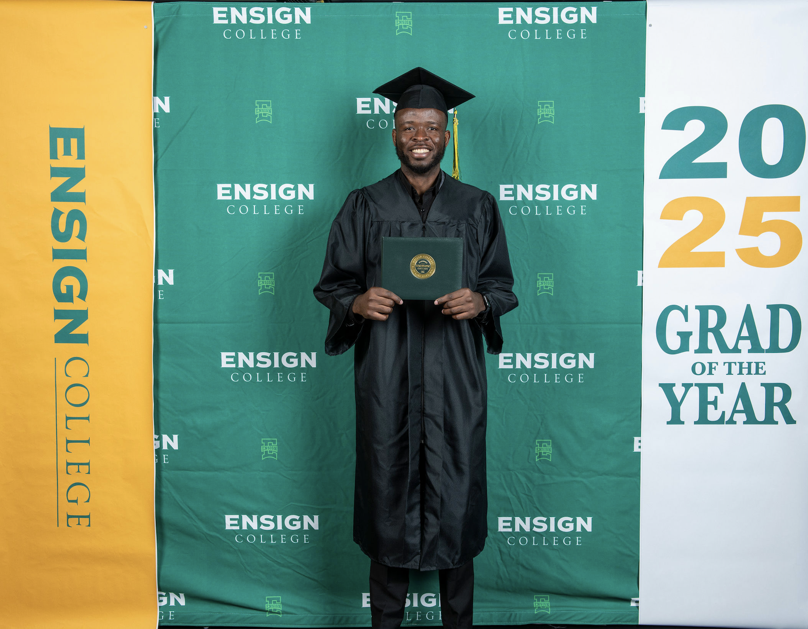

## Welcome to About page

I grew up in the Democratic Republic of Congo and moved to the USA in 2019. Being born in a country with less access to the internet, I decided to move to the USA to study right after serving a full-time mission for the Church of Jesus Christ of Latter-day Saints. I'm eager to learn about technology and make good use of it when I go back home.

I graduated last year from Ensign College with an Associate of Science and a certificate in Software Engineering. I decided to go back to school to continue with the Bachelor of Science to gain more knowledge and get ready for the workforce. I have worked on a couple of sophisticated projects and I am open for internships.

[back](./)